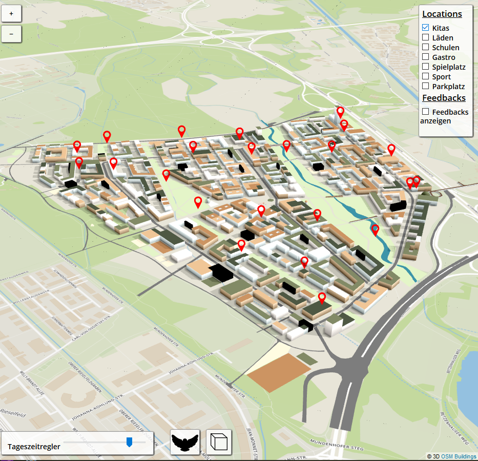
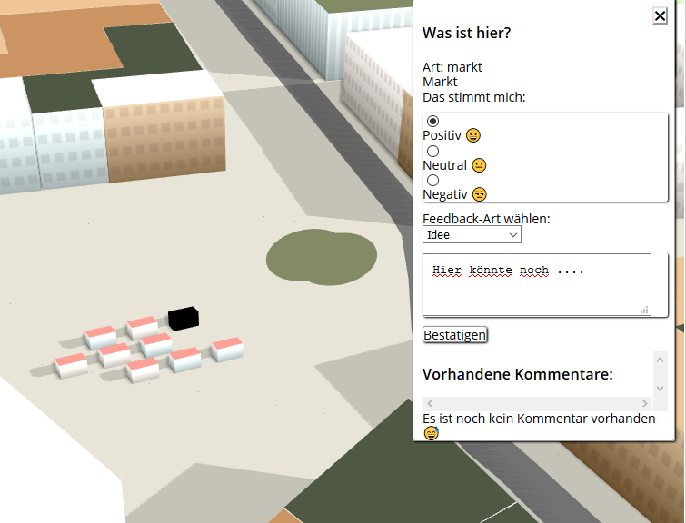
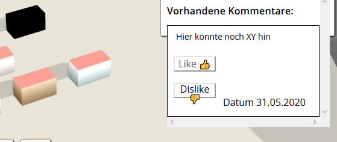

# **#DeinDietenbach** Public Participation Map-Demo

**#DeinDietenbach** ist ein offene 3D-Beteiligungskarte und als [Public Participation GIS](https://de.wikipedia.org/wiki/PPGIS) für den geplanten Freiburger Staddteil [Dietenbach](https://www.freiburg.de/pb/495838.html) gedacht. Auf der Seite kann jedeR sein Feedback und Ideen für das Projekt einbringen und über die Kommentare anderer UserInnen abstimmen. Das Projekt basiert auf [OSM Buildings](https://github.com/OSMBuildings/OSMBuildings).

In der Legende rechts oben können unter *"Locations"* Standorte von Kitas, Läden, Sportplätzen usw. eingeblendet werden. Die Auswahl von "*Feedbacks anzeigen*" gibt an, zu welchen Gebäuden oder Standorten andere UserInnen bereits Kommentare hinterlassen haben.

Per Click auf jedes Gebäude oder eine beliebige Fläche wird eine Info eingeblendet, die neben dem Gebäude-Typ das Hinterlassen eines Feedbacks erlaubt. Falls bereits Kommentare vorhanden sind, können diese mit einem "*Like*" oder "*Dislike*" bewertet werden. 

---
## Live-Version

Die Live-Version des Projekts folgt in den kommenden Tagen.

(Beim Clonen vom Repository müsste ein eigener MongoDB Zugang im .env File angelegt werden.) 
---

## Aktualisierung
Wenn sich  Änderungen in der Stadtteilplanung ergeben, soll die Karte diese aufnehmen. Feedbacks und andere Vorschläge können auch jederzeit aufgenommen werden und die GeoJSON-Grundlage angepasst werden.

Mail: ....

---
## License
[MIT](license.md)